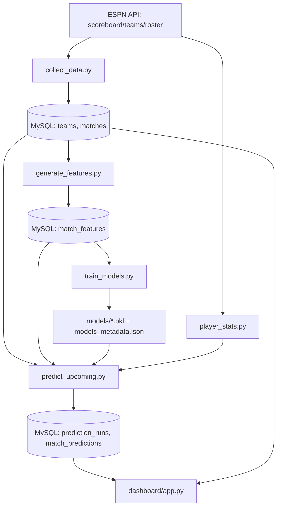

# Football Match Predictor — Detailed Technical Report

This report is a full map of the current program: what data is used, how training works, what windows were tested, how models were compared, how predictions are generated, and how results are shown in Streamlit.

## 1. Project Goal

Predict football match outcomes (`H`, `D`, `A`) and scorelines for upcoming fixtures, store predictions, and track accuracy when final scores arrive.

---

## 2. End-to-End Pipeline (Program Map)



---

## 3. Data Sources

## 3.1 Historical and upcoming fixtures
- Source: ESPN soccer scoreboard API
- Script: `src/collect_data.py`
- Typical command:
```bash
python3 src/collect_data.py --league eng.1 --months-back 24 --days-ahead 14
```

Collection behavior:
- Cleans and validates each event
- Derives `result` from score for completed matches
- Upserts into `matches` (so old fixtures can be updated when final score appears)

## 3.2 Player data (for availability impact in prediction stage)
- Source: ESPN team roster API
- Script: `src/player_stats.py`
- Includes squad stats and injury/unavailable fields when present

---

## 4. Database Tables Used

Core:
- `teams`
- `matches`
- `match_features`

Prediction tracking:
- `prediction_runs`
- `match_predictions`

Current snapshot:
- Total matches: **899**
- Finished matches: **872**
- Upcoming matches: **27**
- Stored predictions: **120**
- Resolved predictions: **0**
- Pending predictions: **120**

---

## 5. Features Used for Model Training

Training features are defined in `src/feature_columns.py` (`TRAINING_FEATURE_COLUMNS`), currently **28 features**:

## 5.1 Form + H2H (base)
1. `home_last5_points`
2. `home_last5_goal_diff`
3. `home_form_pct`
4. `away_last5_points`
5. `away_last5_goal_diff`
6. `away_form_pct`
7. `h2h_home_wins`
8. `h2h_draws`
9. `h2h_away_wins`

## 5.2 Rest/Fatigue
10. `home_days_since_last_match`
11. `away_days_since_last_match`
12. `home_matches_last7`
13. `away_matches_last7`
14. `home_matches_last14`
15. `away_matches_last14`

## 5.3 Travel pressure proxy
16. `home_travel_penalty`
17. `away_travel_penalty`

## 5.4 Home/Away long-window strength
18. `home_home_ppg_last10`
19. `away_away_ppg_last10`
20. `home_home_goal_diff_last10`
21. `away_away_goal_diff_last10`
22. `home_overall_ppg_last30`
23. `away_overall_ppg_last30`
24. `home_overall_goal_diff_last30`
25. `away_overall_goal_diff_last30`

## 5.5 Team rating
26. `home_elo`
27. `away_elo`
28. `elo_diff`

Target:
- `m.result` from `matches` (`H`, `D`, `A`)

---

## 6. What is Used in Training vs Prediction vs UI

## 6.1 Training stage (`src/train_models.py`)
- Uses only historical structured features from `match_features`
- Does **not** include player injury snapshots (no historical injury timeline in current ESPN feed)
- Does **not** include weather

## 6.2 Prediction stage (`src/predict_upcoming.py`)
- Uses all training features + trained models for outcome predictions
- Adds player availability impact (from `player_stats.py`) as a scoreline adjustment:
  - injured/unavailable count
  - top-scorer absences
  - missing goal share
  - availability penalty

Important:
- Player availability is currently used in **prediction-time score adjustment**, not as historical training labels/features.

## 6.3 Streamlit stage (`dashboard/app.py`)
- Pages:
  - `🎯 Dashboard`
  - `🔮 Predictions`
  - `✅ Accuracy`
  - `📈 Statistics`
  - `👤 Player Stats`
  - `🏥 Data Quality`
- Accuracy page is separate and presentation-ready.

---

## 7. Model Training Methodology

Script: `src/train_models.py`

Training setup:
- Dataset: `match_features` joined with `matches` where `result IS NOT NULL`
- Split: **80% train / 20% test**
- Split method: `train_test_split(..., test_size=0.2, stratify=y, random_state=42)`

Models:
1. **Random Forest**
   - `n_estimators=100`
   - `max_depth=10`
   - `min_samples_split=5`
   - `min_samples_leaf=2`

2. **Logistic Regression**
   - Feature scaling via `StandardScaler`
   - `max_iter=1000`
   - `solver='lbfgs'`
   - multinomial classification

Saved artifacts:
- `models/random_forest_model.pkl`
- `models/logistic_regression_model.pkl`
- `models/feature_scaler.pkl`
- `models/models_metadata.json`
- `models/feature_importance.json`

Current latest training metrics (`models/models_metadata.json`):
- Train samples: **697**
- Test samples: **175**
- Random Forest accuracy: **54.86%**
- Logistic Regression accuracy: **52.57%**
- Best by weighted F1: **Random Forest**

---

## 8. Window Validation Experiments

Window = number of recent matches used in form features for each team.

Scripts:
- `src/validate_form_windows.py`
- Uses repeated seeds and reports mean/std/range.

100-seed experiment (windows: 4, 6, 7, 9, 15, 20):

| Window | RF Test Mean ± Std | RF Range | LR Test Mean ± Std | LR Range |
|---|---:|---:|---:|---:|
| 4  | 54.27% ± 2.68% | 48.00%–60.00% | 48.64% ± 3.06% | 41.71%–56.00% |
| 6  | 54.49% ± 3.02% | 45.14%–61.71% | **49.02% ± 2.99%** | 42.29%–56.57% |
| 7  | **54.70% ± 2.85%** | 47.43%–61.71% | 48.87% ± 2.86% | 42.86%–56.00% |
| 9  | 54.59% ± 2.94% | 45.71%–60.57% | 48.48% ± 2.71% | 42.29%–55.43% |
| 15 | 54.22% ± 2.92% | 44.57%–63.43% | 48.70% ± 3.03% | 41.71%–54.29% |
| 20 | 54.36% ± 2.93% | 44.57%–61.71% | 48.19% ± 3.19% | 41.71%–55.43% |

Best windows from this test:
- RF: **7**
- LR: **6**

Saved output:
- `models/form_window_validation_repeated.json`

---

## 9. Current Window Configuration in Code

- `generate_all_features()` currently writes DB `match_features` using `form_window=5`.
- `predict_upcoming.py` default is `--form-window 9`.
- Window validation currently indicates strongest RF mean at `window=7`.

So there is currently a **configuration mismatch** between:
- training table generation default (5),
- prediction default (9),
- best repeated-seed RF window (7).

For strict consistency, use one selected window end-to-end (recommended: set all to 7 if RF is primary).

---

## 10. Prediction Logic and Confidence Interpretation

Script: `src/predict_upcoming.py`

For each upcoming match:
1. Build feature vector
2. Get RF and LR predictions + probabilities
3. Compute consensus
4. Estimate scoreline
5. Apply player availability penalties for scoreline
6. Store prediction in DB (`match_predictions`)
7. Reconcile pending predictions when final scores become available

Confidence meaning:
- `rf_confidence` = RF probability of RF’s predicted **outcome class** (`H/D/A`)
- `lr_confidence` = LR probability of LR’s predicted **outcome class**
- Confidence is **not** confidence for exact scoreline.

---

## 11. What is shown in Streamlit

`dashboard/app.py`:

## 11.1 Predictions page
- Upcoming matches only
- Predicted score
- Predicted winner
- RF outcome + confidence
- LR outcome + confidence
- Warning for stale past fixtures missing final result

## 11.2 Accuracy page (separate page)
- Resolved match count
- Outcome accuracy
- Exact-score accuracy
- Model accuracy comparison chart (RF/LR/Consensus)
- Monthly accuracy trend
- Recent resolved predictions table with correctness flags

---

## 12. Reproducible Commands

```bash
# 1) Collect/update data
python3 src/collect_data.py --league eng.1 --months-back 24 --days-ahead 14

# 2) Regenerate engineered features
python3 src/generate_features.py

# 3) Train models
python3 src/train_models.py

# 4) Validate windows with repeated seeds
python3 src/validate_form_windows.py --windows 4 6 7 9 15 20 --seeds 1 2 3 4 5 6 7 8 9 10
# (extend seeds to 100 as needed)

# 5) Generate/store upcoming predictions
python3 src/predict_upcoming.py --league eng.1 --form-window 7

# 6) Run dashboard
streamlit run dashboard/app.py
```

---

## 13. Limitations and Notes

- Historical injury snapshots are not available in current ESPN source, so injury-based features are not in supervised training yet.
- Weather is not integrated.
- Some sklearn logistic runs show numerical runtime warnings; model still completes and is evaluated.
- Accuracy tracking depends on final scores being updated in `matches` (run collection periodically).

---

## 14. Recommended Next Alignment Step

Pick one form window (based on repeated-seed results, usually RF-focused: **7**) and align:
1. feature generation default,
2. model training data,
3. prediction-time feature window.

This removes train/predict drift and makes the report and demo fully consistent.
